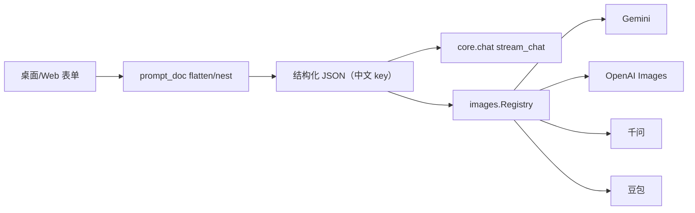
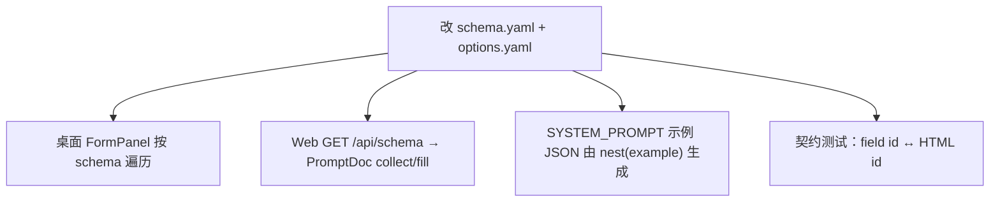
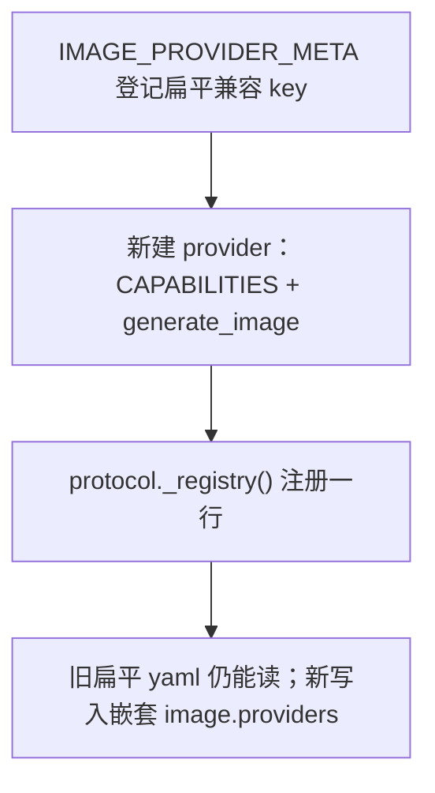

# Architecture

依赖只允许 inward：`desktop` / `web` → `core`。core 零 Qt / Flask 依赖。对外 JSON 继续用中文 key；英文 `id` 只给 Web DOM / 内部 flatten。

```
src/nano_banana/
  core/                 schema、prompt_doc、chat、config、images
  desktop/              PyQt 窗体、FormPanel、ImageGenController、对话框
  web/                  Flask blueprints；静态文件仍在 src/web/static/
src/config/             options.yaml（选项库，不是 schema）
src/presets/
schema SSOT: src/nano_banana/core/schema.yaml
```

## 数据流



## 加字段



Web 表单 HTML 目前仍手写（1a）：新字段要在对应 tab 加 `id="<field.id>"` 的控件。collect/fill/分类预设已经走 schema，不会再双端漂移。

## 加渠道



兼容入口（不改旧命令）：

- `python src/main.py` → `nano_banana.desktop.main`
- `python src/web/app.py` → `nano_banana.web.app`
- `from utils.ai_config import AIConfigManager` 仍可用，内部 re-export core
