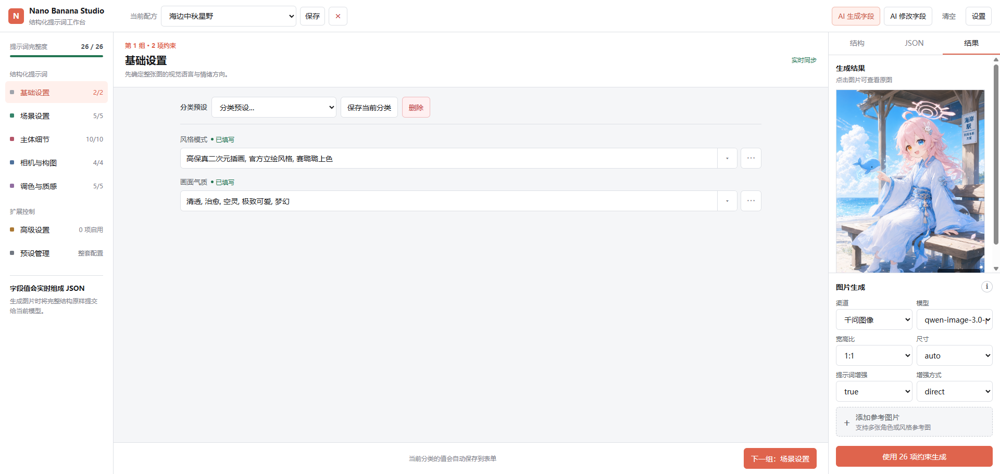

<p align="center">
  
</p>

<h1 align="center">Nano Banana Studio · O1dDing Fork</h1>

<p align="center">
  <strong>结构化提示词 + 多渠道生图，并增强第一阶段联网检索与 Cloudflare 部署稳定性。</strong>
</p>

<p align="center">
  
  
  
  
  
</p>

> 本仓库是 [lissettecarlr/nano-banana-prompt-studio](https://github.com/lissettecarlr/nano-banana-prompt-studio) 的 Fork。保留原项目的 MIT License、原有桌面端/Web 端功能与图片生成渠道，并针对 Web 自托管场景加入下述增强。

## 本 Fork 的主要改动

### 1. 第一阶段：提示词生成 / 修改增加联网三档开关

在“提示词生成模型”配置中增加：

- **禁止联网（disabled）**：完全按原项目方式调用，不主动使用搜索工具。
- **自动联网（auto）**：向支持联网的模型开放搜索工具，由模型自行判断是否需要检索；若第三方兼容网关不支持搜索，则自动回退普通调用，保证兼容性。
- **强制联网（force）**：要求本次第一阶段必须执行联网搜索；若当前模型或网关不支持，则明确返回错误，不静默降级。

第一阶段指：

```text
用户自然语言 / 参考图
        ↓
提示词生成或修改模型
        ↓
结构化 JSON Prompt
```

联网适配按不同 API 能力分别处理，而不是简单给所有模型强塞同一个参数：

| API / Provider | 联网方式 |
|---|---|
| OpenAI / 支持 Responses API 的兼容服务 | `Responses API + web_search` |
| xAI / Grok 等兼容 Responses API 的服务 | `web_search` |
| Gemini 官方接口 | `google_search` |
| Anthropic Claude 官方接口 | Anthropic Web Search Tool |
| 阿里云百炼 / Qwen | `enable_search` / `forced_search` |
| 其他 OpenAI-compatible 中转 | 尝试兼容联网；`auto` 失败回退，`force` 失败报错 |

> 第二阶段图片生成逻辑不使用这一开关；图片模型只接收最终结构化 Prompt 和可选参考图。

### 2. 第二阶段：图片生成异步化，规避 Cloudflare 524

原 Web 版在 `/api/generate-image` 内同步等待图片模型完成。高分辨率或繁忙时生成时间可能超过 Cloudflare 的代理等待窗口，表现为 **524 Timeout**。

本 Fork 改为：

```text
浏览器提交图片生成
        ↓
服务器立即返回 task_id（HTTP 202）
        ↓
ThreadPoolExecutor 后台执行图片生成
        ↓
浏览器轮询 /api/generate-image/status/<task_id>
        ↓
完成后返回图片
```

同时增加：

- 后台任务状态：`queued / processing / completed / failed`
- 任务 TTL 清理，避免 Base64 图片长期占用内存
- 可通过环境变量调整并发与任务保留时间
- 前端对 HTML/代理错误响应给出可读错误，不再只出现 `Unexpected token '<'`

默认环境变量：

```text
IMAGE_TASK_MAX_WORKERS=2
IMAGE_TASK_TTL_SECONDS=1800
```

> 当前任务表保存在 Python 进程内存中，因此 Web 生产运行时应保持**单 Python 进程**；线程并发由 `IMAGE_TASK_MAX_WORKERS` 控制。

## 原项目主要功能

- 可视化编辑结构化提示词
- AI 一句话生成完整结构化提示词
- AI 修改现有结构化提示词
- 参考图片输入
- 预设保存 / 加载 / 删除
- JSON 一键复制
- 多渠道图片生成：
  - Gemini
  - OpenAI Images（`gpt-image-2`）
  - 千问图像
  - 豆包 Seedream

## 界面预览

### 主界面


### AI 生成提示词


### AI 修改提示词


### Web 界面



## 与上游同步

本仓库以原项目为基础维护增强功能。上游项目：

- [lissettecarlr/nano-banana-prompt-studio](https://github.com/lissettecarlr/nano-banana-prompt-studio)

如上游新增图片渠道、模型参数或 UI 更新，应优先同步上游后，再检查本 Fork 的两处核心增强是否仍能正常合并：

1. `src/utils/stage1_web_search.py` 与第一阶段联网调用
2. `src/web/app.py` / `src/web/static/script.js` 的异步生图任务与轮询

## License

沿用上游项目的 **MIT License**。原项目及原作者版权声明保持不变。
